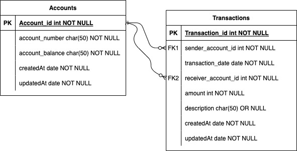

# LEDGER SYSTEM API

An Api to perform and monitor transactions between two accounts.

### Database Design

### Documentation

[Postman documentation](https://documenter.getpostman.com/view/13382488/UyxkmRiT)
